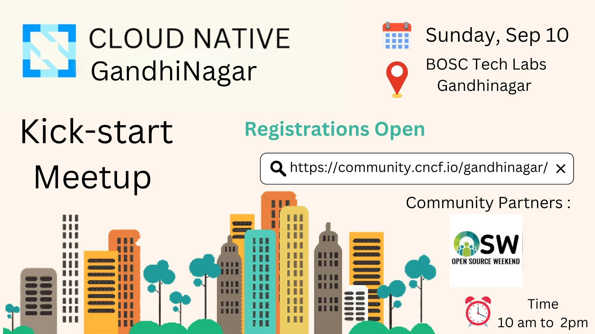
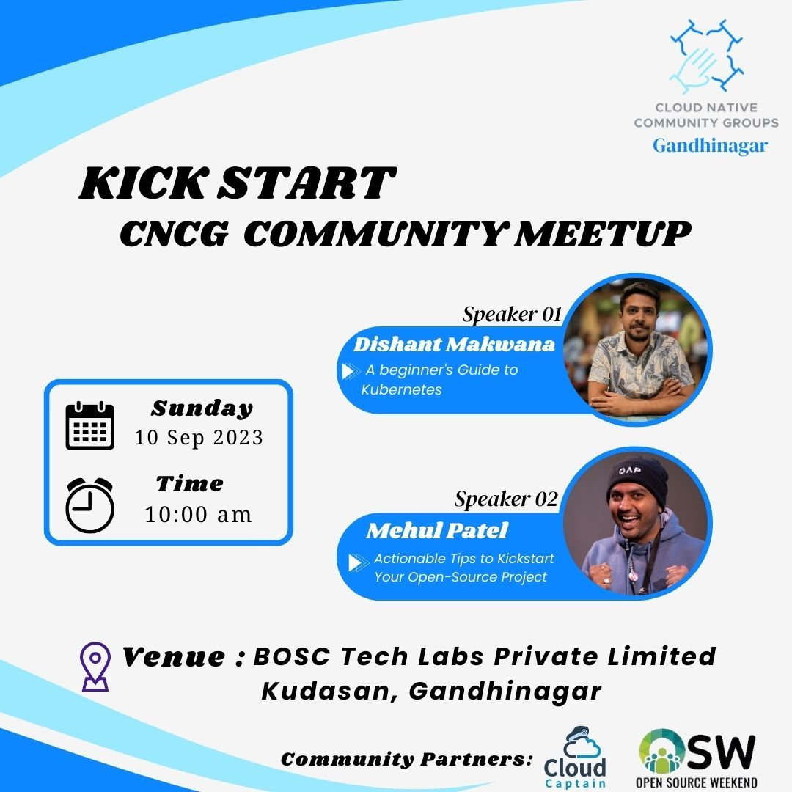

### Talk Details 

#### Speaker 1 : [Mehul Patel](https://twitter.com/NomadicMehul)

* **Title**: 4 Actionable Tips to Kickstart Your Open-Source Project

#### Speaker 2 : Dishant Makwana

* **Title**: A beginner's guide to kubernetes

### Meetup Details 

* [Link to Register](https://community.cncf.io/events/details/cncf-cloud-native-gandhinagar-presents-cloud-native-gandhinagar-kick-start-meetup/)
* 🗓️ Date: 10th Sept'23
* ⏰ Time: 10:00 AM - 02:00 PM
* 🏢 Venue: BOSC Tech Labs Private Limited, Gandhinagar

✅ Prerequisites:
- Bring your system (laptop) with you, should have Kubernetes or minikube installed on it
- Should have minikube installed on your PC. 

## How to Share Your Learnings

1. **Fork this Repository:**
   Click the 'Fork' button at the top right of this repository to create a copy in your GitHub account.

2. **Edit the Attendee_Learnings.md:**
   Navigate to the `Attendee_Learnings.md` file in your forked repository. Click the 'Edit' (pencil) button.

3. **Add Your Details:**
   In the file, add your name and a brief description of what you've learned from today's workshop. For example:
   
   - **Name:** Mehul Patel  
     **Learnings:** Explored Docker containerization and its practical applications in development.

4. **Commit Changes:**
   Scroll down, add a commit message (e.g., "Added my learnings") and click 'Commit Changes'.

5. **Create a Pull Request:**
   After committing changes, navigate back to the main page of your forked repository. Click 'Pull Requests' > 'New Pull Request'. You can review your changes and then create the pull request.

6. **Submit Your Pull Request:**
   Give your pull request a meaningful title and description, then click 'Create Pull Request'.

Thank you for sharing your learnings with us!

<!-- TOC -->

# Introduction-to-kubernetes
[This presentation](Introduction-to-kubernetes/presentation/introduction_to_Kubernetes.pptx) is taken from [Introduction to Kubernetes](https://docs.google.com/presentation/d/1zrfVlE5r61ZNQrmXKx5gJmBcXnoa_WerHEnTxu5SMco) by **Bob Killen** and **Jeffrey Sica**.

## Requirements

- [Docker](https://docs.docker.com/engine/install/)
- [Minikube](https://minikube.sigs.k8s.io/docs/start/)
- [kubectl](https://kubernetes.io/docs/tasks/tools/)

OR

Use Cloud Shell in [Google Cloud Console](console.cloud.google.com) . Cloud Shell comes with the required tools pre-installed.

### To start minikube
    minikube start

### To access the kubernetes dashboard
    minikube dashboard

### To apply resources from kubernetes-examples folder
    kubectl apply -f file-name.yaml

<!-- TOC -->

## What next ? 

Don't forget to check out our project "[CloudCaptain](https://github.com/nomadicmehul/CloudCaptain)" and get all things cloud-related!  

We hope you find this project both informative and engaging.

Don't forget to star this project to show your support for our initiatives. 

Share your love on social media and proudly proclaim, *"Hey, I am a Cloud Captain! #BeaCloudCaptain!"* and included me in your journey by tagging me on [Twitter](https://twitter.com/NomadicMehul). 

<!-- TOC -->

## 🛡️ License

This project is licensed under the **MIT License** - see the [LICENSE](LICENSE) file for details.

